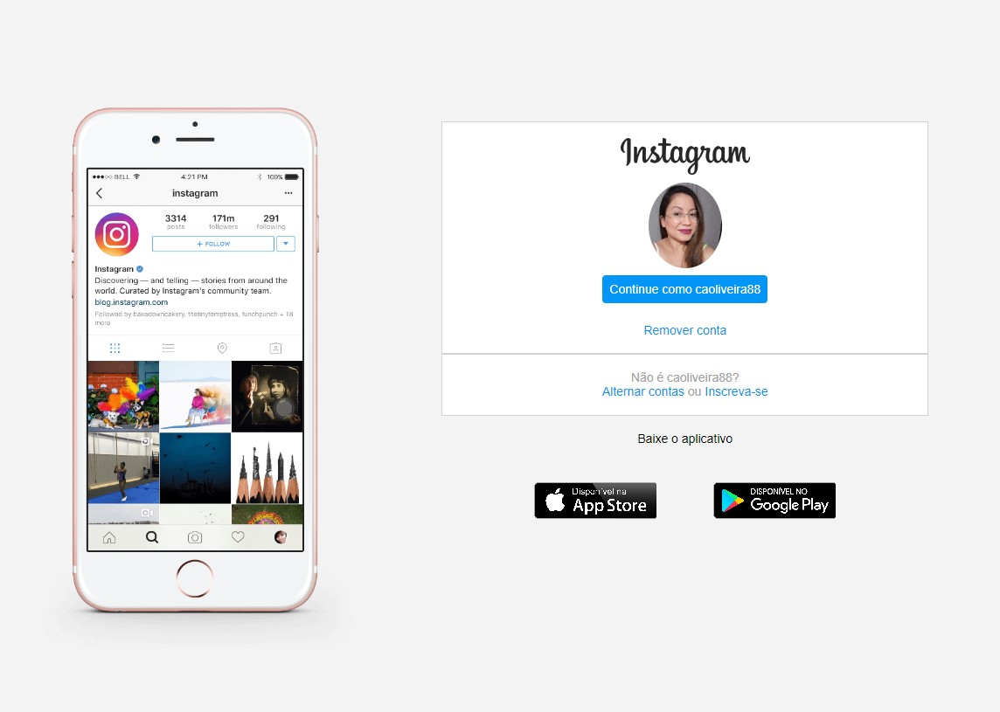

# Clone_pagina_instagram 

Olá! Este projeto marca meus primeiros passos no desenvolvimento web, onde me propus a recriar a página inicial do Instagram. 
Utilizei uma combinação de HTML e CSS para dar vida a esta representação!

 

## Tool kit
- ``HTML:`` A linguagem de marcação que estrutura a base da página.
- ``CSS:`` A folha de estilo que conferiu estilo e design à estrutura HTML.
- ``Flexbox:`` Utilizei o modelo de layout Flexbox para criar um design responsivo e flexível.
- ``VS Code IDEA:`` O ambiente de desenvolvimento integrado que proporcionou uma experiência de codificação eficiente.

## Deploy
Para visualizar o resultado final, acesse [Clone_pagina_instagram](https://caoliveira88.github.io/Recriando_pagina_instagram/)

